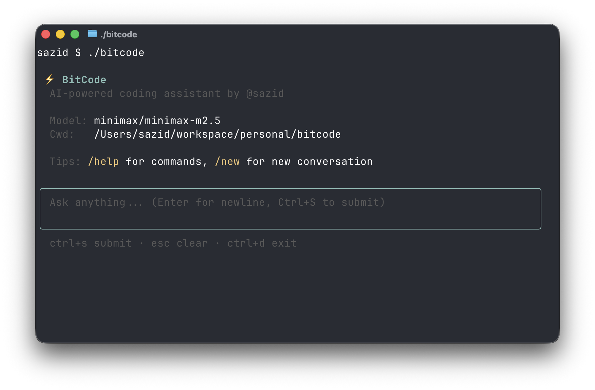

# BitCode

An AI coding assistant built in Go that uses LLMs to understand code and perform actions through tool calls. BitCode implements an agentic loop with multiple integrated tools.



## Features

- **Interactive Mode** — Full TUI with multiline input editor, bordered prompt, and keyboard shortcuts
- **Single-Shot Mode** — Run a single prompt from the command line with `-p`
- **Agent Loop** — Iterative LLM conversation with automatic tool calling (up to 50 turns)
- **Read Tool** — Read files with optional line offset/limit
- **Write Tool** — Create or overwrite files
- **Edit Tool** — Surgical find-and-replace edits
- **Glob Tool** — Fast file pattern matching
- **Bash Tool** — Execute shell commands
- **Markdown Rendering** — Rich terminal output with syntax-highlighted code blocks
- **Reasoning Control** — Adjustable reasoning effort (`--reasoning` flag)
- **OpenRouter Integration** — Works with any OpenAI-compatible API (including local servers)

## Requirements

- Go 1.26+
- An OpenRouter API key (or any OpenAI-compatible endpoint; not required for localhost)

## Getting Started

### 1. Clone and configure

Create a `.env` file in the project root with your API key:

```
OPENROUTER_API_KEY=sk-or-v1-xxxxxxxxxxxx
```

Optionally set the model and base URL:

```
OPENROUTER_MODEL=anthropic/claude-sonnet-4-20250514
OPENROUTER_BASE_URL=https://openrouter.ai/api/v1
```

### 2. Build

```sh
go build -o bitcode ./app
```

### 3. Run

**Interactive mode** (default):

```sh
./bitcode
```

This launches a TUI with a multiline input editor. Use `Ctrl+S` to submit, `Enter` for newlines, `Esc` to clear, and `Ctrl+D` to exit.

**Single-shot mode:**

```sh
./bitcode -p "Your prompt here"
```

**With reasoning effort:**

```sh
./bitcode --reasoning high -p "Refactor the agent loop"
```

**With a different model:**

```sh
OPENROUTER_MODEL=anthropic/claude-sonnet-4-20250514 ./bitcode -p "Explain main.go"
```

**With a local server (no API key needed):**

```sh
OPENROUTER_BASE_URL=http://localhost:1234/v1 OPENROUTER_MODEL=local-model ./bitcode
```

## Environment Variables

| Variable | Description | Default |
|---|---|---|
| `OPENROUTER_API_KEY` | API key for OpenRouter (not required for localhost) | *(required for remote)* |
| `OPENROUTER_BASE_URL` | Base URL for the API | `https://openrouter.ai/api/v1` |
| `OPENROUTER_MODEL` | Model to use | `openrouter/free` |

## Interactive Mode Keys

| Key | Action |
|---|---|
| `Ctrl+S` | Submit input |
| `Enter` | New line |
| `Escape` | Clear input |
| `Ctrl+C` | Clear input (exit if empty) |
| `Ctrl+D` | Exit |

## Commands

Type these in the interactive prompt:

| Command | Description |
|---|---|
| `/new` | Start a new conversation |
| `/help` | Show help |
| `/exit` | Exit BitCode |

## Example Prompts

Below are example prompts that exercise every tool. Each shows the kind of tool calls the agent makes, including how it recovers from errors.

### Read Tool

**Basic file read:**

```sh
./bitcode -p "Show me the contents of go.mod"
```

The agent calls `Read` with `file_path: "go.mod"` and displays the file.

**Read with offset and limit:**

```sh
./bitcode -p "Show me lines 10 through 20 of app/main.go"
```

The agent calls `Read` with `file_path: "app/main.go"`, `offset: 10`, `limit: 11`.

**Error and retry — file not found:**

```sh
./bitcode -p "Read the file src/server.go and summarize it"
```

The agent calls `Read` with `file_path: "src/server.go"` — gets an error (file does not exist). It then uses `Glob` with `pattern: "**/server.go"` to search for the file. Finding nothing, it reports that no such file exists and suggests alternatives.

### Write Tool

**Create a new file:**

```sh
./bitcode -p "Create a file called hello.txt that says Hello, World!"
```

The agent calls `Write` with `file_path: "hello.txt"` and `content: "Hello, World!\n"`.

**Error and retry — path traversal blocked:**

```sh
./bitcode -p "Write a config file to ../outside/config.json"
```

The agent calls `Write` with a path containing `..` — gets a security error. It explains why the path was rejected and asks for a safe location instead.

### Edit Tool

**Find and replace:**

```sh
./bitcode -p "In README.md, change 'BitCode' to 'BitCode CLI'"
```

The agent calls `Read` on `README.md` first, then `Edit` with `old_string: "BitCode"`, `new_string: "BitCode CLI"`. If `old_string` appears multiple times and `replace_all` is not set, it replaces the first occurrence.

**Error and retry — old_string not found:**

```sh
./bitcode -p "In go.mod, replace 'require foo v1.0' with 'require foo v2.0'"
```

The agent calls `Read` on `go.mod`, then `Edit` with the given strings — gets an error because the exact string doesn't exist. It re-reads the file, finds the actual dependency line, and retries with the correct `old_string`.

### Glob Tool

**Find files by pattern:**

```sh
./bitcode -p "List all Go test files in this project"
```

The agent calls `Glob` with `pattern: "**/*_test.go"` and returns the list.

**Scoped search:**

```sh
./bitcode -p "Find all .go files under internal/"
```

The agent calls `Glob` with `pattern: "**/*.go"` and `path: "internal/"`.

**Error and retry — no matches:**

```sh
./bitcode -p "Find all Python files in this project"
```

The agent calls `Glob` with `pattern: "**/*.py"` — gets zero results. It reports that no Python files exist and describes what it did find (Go files).

### Bash Tool

**Run a command:**

```sh
./bitcode -p "What version of Go is installed?"
```

The agent calls `Bash` with `command: "go version"` and `description: "Check Go version"`.

**Run tests:**

```sh
./bitcode -p "Run all the tests and tell me if anything fails"
```

The agent calls `Bash` with `command: "go test ./..."` and `description: "Run all Go tests"`. It reads stdout/stderr and summarizes pass/fail results.

**Error and retry — command fails:**

```sh
./bitcode -p "Compile the project and show me any errors"
```

The agent calls `Bash` with `command: "go build ./app"`. If there are compile errors (non-zero exit code), it reads the error output, uses `Read` to examine the problematic file, then uses `Edit` to fix the issue and retries the build.

### Multi-Tool Scenarios

**Explore and refactor:**

```sh
./bitcode -p "Find all files that import the fmt package and add a comment at the top of each one"
```

The agent chains multiple tools: `Bash` (with `grep -r`) or `Glob` + `Read` to find files, then `Edit` on each file to add the comment.

**Investigate and fix a bug:**

```sh
./bitcode -p "The glob tool doesn't handle symlinks. Find the glob implementation and fix it."
```

The agent calls `Glob` to find `**/glob.go`, then `Read` to examine the implementation, then `Edit` to patch the code, and finally `Bash` to run `go test ./internal/tools/` to verify the fix.

**Create a new tool skeleton:**

```sh
./bitcode -p "Create a new Grep tool in internal/tools/grep.go following the same pattern as the other tools"
```

The agent calls `Read` on an existing tool (e.g., `internal/tools/read.go`) to understand the pattern, then `Write` to create `grep.go`, then `Bash` to run `go build ./...` to verify it compiles.

## Project Structure

```
app/
  main.go           # Entry point, CLI flags, interactive REPL loop
  agent.go          # Agent loop (LLM ↔ tool call cycle)
  input.go          # TUI input editor (bubbletea textarea)
  render.go         # Terminal rendering (markdown, spinner, events)
  system_prompt.go  # System prompt construction
internal/
  event.go          # Event types for tool output
  llm/
    llm.go          # Provider interface, message types, content blocks
    openai.go       # OpenAI-compatible provider (sync + streaming)
  tools/            # Tool implementations (read, write, edit, glob, bash)
```

## License

MIT
